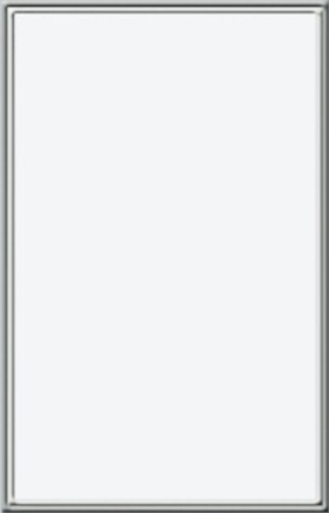

# JS Based CSS

A creative showcase of advanced, JavaScript-powered CSS techniques and interactive web design experiments by **myTech.Today**.

## Features

- **Skeuomorphic Design**: Realistic dark and light themes with leather, paper, and whiteboard textures
- **Interactive Style Cards**: Clickable design examples with hover effects and dynamic theming
- **Whiteboard Interface**: Realistic post-it note style cards with varied colors and curled corners
- **Typewriter & Cinematic Styles**: Beautiful typography and video background integration
- **Dynamic Theme Switching**: Smooth transitions between multiple visual styles
- **Pure Vanilla**: Built with HTML, CSS, and JavaScript — no frameworks required

## Demo

Open `index.html` in your browser to explore the interactive showcase.

## Screenshots

## Technologies

- HTML5
- CSS3 (Advanced techniques, variables, gradients, shadows)
- Vanilla JavaScript
- Google Fonts

## Purpose

This repository serves as both a design inspiration gallery and a technical playground for pushing the boundaries of what can be achieved with modern CSS combined with JavaScript.

## License

MIT License

---

*Made with ❤️ by myTech.Today*
